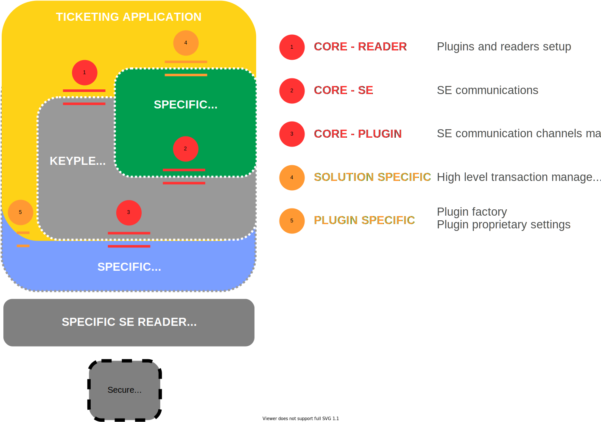

# Understanding the Keyple stack 1.0

Below is a simplified illustration of the main Keyple APIs existing between a ticketing application and a secure element.

The simplification is here mainly related to the fact that the potential for dual access to a portable secure element (PO) and an internal secure element (SAM) is not shown. However, the approach to access to each of these elements follows this scheme.

The software components that are a supply from Keyple (or a partner) are surrounded by dotted lines.

The component here generically named "Keyple SE Solution Extension" corresponds so far to the Keyple Calypso module dedicated to the processing of Calypso transactions. It could be supplemented by a similar component dedicated to the processing of another family of secure elements.

# The 5 Keyple APIs

## 1. SeProxyService and Event API

The `SeProxyService` allows the instantiation (and the removal) of plugins from the plugin factories provided by each plugin (see interface 2).

It also provides additional services to get the current plugins and the module version.

### API Overview
|Class `SeProxyService`	                                | Singleton class hosting all registered plugins. |
|---	                                                |---	                                          |
|`getInstance():SeProxyService`	                        | Gets the SeProxyService instance|
|`registerPlugin(PluginFactory): ReaderPlugin`	    | Registers a new plugin|
|`unregisterPlugin(String):boolean`	                    | Unregisters a plugin from its name|
|`getPlugin(String):ReaderPlugin`	                    | Gets a plugin from its name|
|`getPlugins():Map<String, ReaderPlugin>`	            | Gets a map associating all registered plugins and their respective names.|
|`getVersion():String`	                                | Gets a string representation of the Keyple Core version (“X.Y.Z”).|

|Interface `ObservablePlugin`	                        | Extension of `ReadPlugin` with observability features. |
|---	                                                |---	                                          |
|`addObserver(ObservablePlugin.PluginObserver):void`	| Adds a plugin observer|
|`removeObserver(ObservablePlugin.PluginObserver):void`	| Removes a plugin observer|
|`clearObservers():void`	                            | Removes all observers|
|`countObservers():int`	                                | Gets the number of observers|

|Interface `ObservablePlugin.PluginObserver`	        | Defines the plugin event handler. |
|---	                                                |---	                                          |
|`update(PluginEvent):void`	                            | Callback method implemented by the application to received plugin events|

|Class `PluginEvent`	                                | Carries a plugin event. |
|---	                                                |---	                                          |
|`getEventType():PluginEvent.EventType`                 | Gets the type of event|
|`getPluginName():String`                               | Gets the name of the plugin that produced the event|
|`getReaderNames():SortedSet<String>`                   | Gets the set of readers concerned by the event|

|Enum `PluginEvent.EventType`                           | The different types of plugin events. |
|---	                                                |---	                                |
|`READER_CONNECTED`                                     | When one or more readers are connected|
|`READER_DISCONNECTED`                                  | When one or more readers are disconnected|

|Interface `ObservableReader`	                        | Extension of `SeReader` with observability features. |
|---	                                                |---	                                          |
|`addObserver(ReaderObserver):void`	                    | Adds a reader observer|
|`removeObserver(ReaderObserver):void`	                | Removes a reader observer|
|`clearObservers():void`	                            | Removes all observers|
|`countObservers():int`	                                | Gets the number of observers|

|Interface `ObservableReader.ReaderObserver`	        | Defines the reader event handler. |
|---	                                                |---	                                          |
|`update(PluginEvent):void`	                            | Callback method implemented by the application to received reader events|

|Class `ReaderEvent`	                                | Carries a reader event. |
|---	                                                |---	                                          |
|`getEventType():ReaderEvent.EventType`                 | Gets the type of event|
|`getPluginName():String`                               | Get the name of the plugin to which the reader that produced the event belongs|
|`getReaderName():String`                               | Gets the name of readers that produced the event|

|Enum `ReaderEvent.EventType`                           | The different types of reader events. |
|---	                                                |---	                                |
|`SE_INSERTED`                                          | A Secure Element has been inserted, without a selection having been made, either because it was not requested or because it did not match and a notification was requested. |
|`SE_MATCHED`                                           | A Secure Element has been inserted and corresponds to one of the selection cases provided in the default selection..|
|`SE_REMOVED`                                           | The Secure Element has been removed.|
|`TIMEOUT_ERROR`                                        | A time out error occurred while scanning Secure Elements (not implemented by current plugins) |

DefaultSelection TBD

{}
See the **org.eclispe.keyple.core.seproxy** and **org.eclispe.keyple.core.seproxy.event** packages for further information about the detailed Java implementation of this API.
{}

## 2. Plugin factory and proprietary plugin and reader settings API

TBD

## 3. Calypso transaction API

TBD

## 4. Reader API

TBD

## 5. Plugin API

TBD

# JavaDoc 
The JavaDoc for the Keyple project is available online. The documentation is split into the following parts:

RELEASES

LATEST SNAPSHOTS
- <a href="/keyple-website/reference/keyple-java-core/index.html" target="_blank">JavaDoc for the Keyple Core API</a>
- <a href="/keyple-website/reference/keyple-java-calypso/index.html" target="_blank">JavaDoc for the Keyple Calypso API</a>
- <a href="/keyple-website/reference/keyple-java-plugin-pcsc/index.html" target="_blank">JavaDoc for the Keyple PC/SC plugin API</a>
- <a href="/keyple-website/reference/keyple-java-plugin-remotese/index.html" target="_blank">JavaDoc for the Keyple Remote SE plugin API</a>
- <a href="/keyple-website/reference/keyple-java-plugin-stub/index.html" target="_blank">JavaDoc for the Keyple Stub plugin API</a>
- <a href="/keyple-website/reference/keyple-android-plugin-nfc/index.html" target="_blank">JavaDoc for the Keyple Android NFC plugin API</a>
- <a href="/keyple-website/reference/keyple-android-plugin-omapi/index.html" target="_blank">JavaDoc for the Keyple Android OMAPI plugin API</a>

